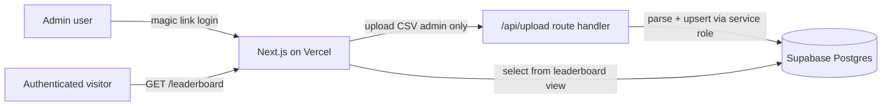

# ADR 0001: MVP architecture for Cursor events leaderboard

**Status:** Proposed  
**Date:** 2026-05-19

## Context

We want a lightweight, free-tier webpage that tracks community event attendance and surfaces a leaderboard showing who attends the most Cursor community events.

### Goal

- Accept a CSV export of event participants from [Luma](https://lu.ma/).
- Award **1 point per event attended** to each participant, identified by **email**.
- Display a **leaderboard** ranked by total points (events attended).
- Run entirely on **free tiers**: Vercel (hosting) + Supabase (Postgres, Auth).

### Constraints


| Constraint             | Decision                                               |
| ---------------------- | ------------------------------------------------------ |
| Hosting budget         | Vercel free tier                                       |
| Database budget        | Supabase free tier                                     |
| Auth                   | Supabase Auth (magic link)                             |
| CSV upload access      | Admin allowlist only (`ADMIN_EMAILS` env var)          |
| Leaderboard visibility | Any authenticated user; **name only** (no email shown) |
| Design system          | Cursor Community Brand Guidelines (see Appendix B)     |
| Stack                  | Next.js App Router — no separate backend service       |


### Non-goals (v1)

- No Luma API integration (CSV upload only).
- No multi-tenant / multi-community support.
- No point decay, badges, seasons, or gamification beyond raw counts.
- No public (unauthenticated) leaderboard.
- No email notifications or webhooks.
- No participant self-registration or profile editing.

---

## Decision

Build a **Next.js App Router** application deployed on **Vercel**, backed by **Supabase Postgres** with **Supabase Auth** and **Row Level Security (RLS)** on every table.

### System overview




### Frontend and hosting

- **Framework:** Next.js (App Router) on Vercel free tier.
- **Rendering:** Server Components for the leaderboard page; Client Components only where interactivity is required (CSV upload form, auth UI).
- **Styling:** Tailwind CSS with Cursor brand tokens (Appendix B) exposed as CSS custom properties for light/dark theme support.
- **No separate backend:** all server logic lives in Next.js Route Handlers and Server Components.

### Database and auth

- **Database:** Supabase Postgres (free tier).
- **Auth:** Supabase Auth with magic-link email login. The entire app requires authentication.
- **RLS:** enabled on all tables. Authenticated users can `SELECT` from the `leaderboard` view. All writes go through a Route Handler using the Supabase **service-role key** (never exposed to the browser).

### Authorization model


| Action                                          | Who                                                      |
| ----------------------------------------------- | -------------------------------------------------------- |
| View leaderboard                                | Any authenticated user                                   |
| Upload CSV                                      | Admin only — email must appear in `ADMIN_EMAILS` env var |
| Create/update participants, events, attendances | Service-role key via `/api/upload` Route Handler only    |


Admin check happens server-side in the Route Handler before any CSV parsing or database writes.

### Identity and scoring model

- A **participant** is uniquely identified by their **email** (stored lowercased and trimmed).
- **Name** is taken from the CSV's most recent non-empty value and updated on each upload if changed.
- **Email is stored but never rendered** on the public leaderboard (name only).
- **Scoring:** 1 point per `(participant, event)` pair.
- A composite primary key on `attendance(participant_id, event_id)` makes re-uploading the same CSV **idempotent** — duplicate rows are skipped, not double-counted.

### Event identity

Each CSV upload creates one `event` row. The admin provides:

- `name` — human-readable event name (form input at upload time).
- `event_date` — date of the event (form input at upload time).

Additionally stored for audit and future deduplication:

- `luma_event_api_id` — extracted from the CSV when the column is present.
- `source_filename` — original CSV filename.
- `uploaded_by` — Supabase Auth user ID of the admin who uploaded.

### CSV ingestion

- Parsed **server-side** in a Route Handler (`/api/upload`) using `papaparse`.
- Inserts executed in a **single transaction** via the Supabase service-role client.
- Returns a JSON summary:

```json
{
  "event_id": "uuid",
  "new_participants": 12,
  "new_attendances": 45,
  "skipped_duplicates": 3
}
```

See **Appendix C** for the expected Luma CSV column mapping.

**v1 scoring rule:** a point is awarded for every row in the CSV regardless of `checked_in_at` or `approval_status`. This is configurable in a future iteration.

### Leaderboard

- Implemented as a **Postgres view** (`leaderboard`) — see Appendix A.
- Columns: `participant_id`, `name`, `points`, `events_attended`, `last_seen_at`.
- Ordered by `points DESC`, ties broken by `last_seen_at DESC`.
- Rendered as a Server Component on `/leaderboard`.
- Rank #1 receives the accent color highlight (`#f54e00`); all other ranks use neutral foreground.

### Design system

All UI must follow the **Cursor Community Brand Guidelines** (Appendix B):

- Use the neutral palette as the base; accent orange sparingly for primary CTAs and rank highlights.
- **Sentence case** for all headings, labels, and titles.
- Voice: quiet confidence — clear, concise, approachable. No hype.
- Typography: **Cursor Gothic** when licensed for web use; **Inter** as interim fallback (see Open items).
- Light and dark themes supported via CSS custom properties mapped from the brand token table.
- Logo: use provided horizontal lockup at modest size with adequate breathing room (≥ ⅓ cube width). Do not create custom lockups or oversized placements.

### Environment variables


| Variable                        | Purpose                                                     |
| ------------------------------- | ----------------------------------------------------------- |
| `NEXT_PUBLIC_SUPABASE_URL`      | Supabase project URL                                        |
| `NEXT_PUBLIC_SUPABASE_ANON_KEY` | Supabase anon key (browser-safe)                            |
| `SUPABASE_SERVICE_ROLE_KEY`     | Service-role key (server only, never exposed)               |
| `ADMIN_EMAILS`                  | Comma-separated list of admin emails allowed to upload CSVs |


### Proposed route structure


| Route            | Type             | Purpose                                   |
| ---------------- | ---------------- | ----------------------------------------- |
| `/`              | Server Component | Redirect to `/leaderboard`                |
| `/leaderboard`   | Server Component | Public-facing leaderboard (auth required) |
| `/upload`        | Client Component | Admin CSV upload form                     |
| `/login`         | Client Component | Magic-link login                          |
| `/api/upload`    | Route Handler    | CSV parse + upsert (admin only)           |
| `/auth/callback` | Route Handler    | Supabase Auth callback                    |


---

## Consequences

### Positive

- **Zero cost** to operate at community scale on free tiers.
- **Simple mental model:** 1 CSV upload = 1 event = 1 point per attendee.
- **Idempotent uploads** prevent accidental double-counting.
- **Privacy-friendly leaderboard** — names only, no emails exposed.
- **Self-contained ADR** — design tokens and data model documented here, no external dependency for implementation.

### Negative / trade-offs

- **Manual process:** an admin must export and upload a CSV after every event. No automation.
- **Single community:** no tenant isolation; all events share one leaderboard.
- **Trust-based scoring:** v1 awards points for all CSV rows, not just checked-in attendees.
- **Admin allowlist via env var:** adding admins requires a redeploy (acceptable for v1 scale).
- **Service-role key in Route Handler:** bypasses RLS for writes; must never leak to the client.
- **Cursor Gothic font:** licensing for web embedding is unresolved; Inter is a temporary stand-in.

### Follow-ups (post-v1)

- Lock exact Luma CSV column names once a sample CSV is provided.
- Confirm Cursor Gothic web font licensing and self-host if approved.
- Add optional `checked_in_at` filter for point awarding.
- Dedupe events by `luma_event_api_id` to prevent creating duplicate event rows on re-upload.
- Admin management UI (instead of env-var allowlist).
- Export leaderboard as CSV.
- Luma API integration to eliminate manual CSV uploads.

---

## Open items


| Item                               | Status       | Notes                                 |
| ---------------------------------- | ------------ | ------------------------------------- |
| Exact Luma CSV column names        | **Pending**  | Awaiting sample CSV from stakeholder  |
| Cursor Gothic font licensing       | **Pending**  | Use Inter as fallback until confirmed |
| Require `checked_in_at` for points | **Deferred** | v1 awards points for all rows         |


---

## Appendix A — Data model

### Tables

```sql
-- Participants: one row per unique email
create table participant (
  id         uuid        primary key default gen_random_uuid(),
  email      text        not null unique,
  name       text        not null,
  created_at timestamptz not null default now(),
  updated_at timestamptz not null default now()
);

-- Events: one row per CSV upload / Luma event
create table event (
  id                uuid        primary key default gen_random_uuid(),
  name              text        not null,
  event_date        date        not null,
  luma_event_api_id text,
  source_filename   text,
  uploaded_by       uuid        references auth.users(id),
  created_at        timestamptz not null default now()
);

-- Attendance: one row per (participant, event) — the source of truth for points
create table attendance (
  participant_id uuid        not null references participant(id) on delete cascade,
  event_id       uuid        not null references event(id) on delete cascade,
  checked_in     boolean     not null default false,
  created_at     timestamptz not null default now(),
  primary key (participant_id, event_id)
);
```

### Leaderboard view

```sql
create view leaderboard as
select
  p.id                          as participant_id,
  p.name,
  count(a.event_id)::int        as points,
  count(a.event_id)::int        as events_attended,
  max(e.event_date)             as last_seen_at
from participant p
join attendance a on a.participant_id = p.id
join event e      on e.id = a.event_id
group by p.id, p.name;
```

### Row Level Security

```sql
alter table participant enable row level security;
alter table event       enable row level security;
alter table attendance  enable row level security;

-- Authenticated users can read participant names (for leaderboard)
create policy "Authenticated users can read participants"
  on participant for select
  to authenticated
  using (true);

-- Authenticated users can read events (for context/debugging)
create policy "Authenticated users can read events"
  on event for select
  to authenticated
  using (true);

-- Authenticated users can read attendance (via leaderboard view)
create policy "Authenticated users can read attendance"
  on attendance for select
  to authenticated
  using (true);

-- No direct insert/update/delete policies for authenticated users.
-- All writes go through the service-role key in the /api/upload Route Handler.
```

### Indexes

```sql
create index idx_attendance_participant on attendance(participant_id);
create index idx_attendance_event       on attendance(event_id);
create index idx_event_date             on event(event_date desc);
create index idx_participant_email      on participant(email);
```

---

## Appendix B — Cursor Community Brand Guidelines

> Source: [Cursor Community Brand Guidelines](https://cursorai.notion.site/Cursor-Community-Brand-Guidelines-2a2da74ef04580e2aa05e8c85972d742) (Sept 2025). Reproduced here so this ADR is self-contained for implementation.

### Logos

Logos are Cursor's most visible marker and consist of the **cube and wordmark**.

**Do**

- Use the provided horizontal and vertical lockups.
- Use enough space around the cube (equivalent to at least ⅓ cube width).
- Primarily use the 2D version as our logo.
- Use our logo with restraint and modesty.

**Don't**

- Don't create your own logo lockups.
- Don't crowd the logo — give it space to breathe.
- Don't create custom patterns with our logo.
- Don't display the logo in a context where it feels oversized.

Brand asset packages: `Cursor Brand Assets Sept 2025.zip`, `Cursor Brand Guidelines Sept 2025.zip`, `Cursor Logo Animations.zip`.

### Color

Cursor's brand colors are **neutral and understated** with a **bright orange accent**. Use neutrals as the base, and keep the accent sparing so it feels sharp and intentional.

#### Light theme


| Token     | Hex       | RGB           | HSL           | Usage                                       |
| --------- | --------- | ------------- | ------------- | ------------------------------------------- |
| `bg`      | `#f7f7f4` | 247, 247, 244 | 60, 16%, 96%  | Main background                             |
| `fg`      | `#26251e` | 38, 37, 30    | 53, 12%, 13%  | Primary text; secondary text at 60% opacity |
| `accent`  | `#f54e00` | 245, 78, 0    | 19, 100%, 48% | Primary accent — use sparingly              |
| `card`    | `#f2f1ed` | 242, 241, 237 | 48, 16%, 94%  | Default card background                     |
| `card-01` | `#f0efeb` | 240, 239, 235 | 48, 14%, 93%  | Card level 1 (1% darker)                    |
| `card-02` | `#ebeae5` | 235, 234, 229 | 50, 13%, 91%  | Card level 2 (2.5% darker)                  |
| `card-03` | `#e6e5e0` | 230, 229, 224 | 50, 11%, 89%  | Card level 3 (5% darker)                    |
| `card-04` | `#e1e0db` | 225, 224, 219 | 50, 9%, 87%   | Card level 4 (7.5% darker)                  |


#### Dark theme


| Token     | Hex       | RGB           | HSL           | Usage                                       |
| --------- | --------- | ------------- | ------------- | ------------------------------------------- |
| `bg`      | `#14120b` | 20, 18, 11    | 47, 29%, 6%   | Main background                             |
| `fg`      | `#edecec` | 237, 236, 236 | 0, 3%, 93%    | Primary text; secondary text at 60% opacity |
| `accent`  | `#f54e00` | 245, 78, 0    | 19, 100%, 48% | Primary accent — use sparingly              |
| `card`    | `#1b1913` | 27, 25, 19    | 45, 17%, 9%   | Default card background                     |
| `card-01` | `#1d1b15` | 29, 27, 21    | 45, 16%, 10%  | Card level 1 (1% lighter)                   |
| `card-02` | `#201e18` | 32, 30, 24    | 45, 14%, 11%  | Card level 2 (2.5% lighter)                 |
| `card-03` | `#26241e` | 38, 36, 30    | 45, 12%, 13%  | Card level 3 (5% lighter)                   |
| `card-04` | `#2b2923` | 43, 41, 35    | 45, 10%, 15%  | Card level 4 (7.5% lighter)                 |


#### Tailwind / CSS variable mapping (implementation reference)

```css
:root {
  --color-bg:      #f7f7f4;
  --color-fg:      #26251e;
  --color-accent:  #f54e00;
  --color-card:    #f2f1ed;
  --color-card-01: #f0efeb;
  --color-card-02: #ebeae5;
  --color-card-03: #e6e5e0;
  --color-card-04: #e1e0db;
}

@media (prefers-color-scheme: dark) {
  :root {
    --color-bg:      #14120b;
    --color-fg:      #edecec;
    --color-accent:  #f54e00;
    --color-card:    #1b1913;
    --color-card-01: #1d1b15;
    --color-card-02: #201e18;
    --color-card-03: #26241e;
    --color-card-04: #2b2923;
  }
}
```

**UI application rules for this project:**

- Page background: `bg`.
- Leaderboard rows: `card` with hover state `card-01`.
- Primary CTA (upload button): `accent` background, white text.
- Rank #1 highlight: `accent` text or left border.
- Secondary text (event counts, dates): `fg` at 60% opacity.
- Do not use accent for decorative elements, backgrounds, or large areas.

### Typography

- **Primary typeface:** Cursor Gothic (official brand typeface).
- **Interim fallback:** Inter (neutral, clean; swap once Cursor Gothic web license is confirmed).
- Apply via `font-family: 'Cursor Gothic', Inter, system-ui, sans-serif`.

### Voice and tone

Cursor speaks with **quiet confidence**: clear, concise, and approachable.

**Do**

- Say things simply and directly.
- Be clear and concise, but complete.
- Stay professional and considerate.

**Don't**

- Don't oversell or exaggerate.
- Don't try too hard to be funny or casual.
- Don't hide meaning in jargon or corporate speak.

**Copy examples for this app:**


| Element           | Copy                                                      |
| ----------------- | --------------------------------------------------------- |
| Page title        | Event leaderboard                                         |
| Upload page title | Upload event attendees                                    |
| Empty state       | No events recorded yet. Upload a Luma CSV to get started. |
| Upload success    | 45 attendees added across 12 new participants.            |
| Login prompt      | Sign in to view the leaderboard.                          |


### Casing and punctuation

Use **sentence case** for all headings, labels, and titles outside the Cursor IDE. No need to capitalize words outside of proper nouns.

**Do:** "Upload event attendees", "Event leaderboard", "Sign in"  
**Don't:** "Upload Event Attendees", "Event Leaderboard", "Sign In"

### Logo animations

Cursor logos come in animated versions for different use cases (video end cards, loading animations).

- Use where motion adds delight.
- Avoid overuse or distracting loops.
- Acceptable use in this app: a subtle loading spinner during CSV upload processing.

### Photography

Warm, not overproduced, and precise in intent. Natural light and candid shots.

- Not directly applicable to v1 (no photo-heavy pages).
- If event imagery is added later: warm natural tones, candid shots, no overproduced stock.

---

## Appendix C — Luma CSV contract

### Expected columns

Based on standard Luma guest-list exports. **Exact column names are pending confirmation** once a sample CSV is provided.


| CSV column (assumed) | Maps to                   | Required | Notes                                                                |
| -------------------- | ------------------------- | -------- | -------------------------------------------------------------------- |
| `name`               | `participant.name`        | Yes      | Display name on leaderboard                                          |
| `email`              | `participant.email`       | Yes      | Unique identifier; never displayed                                   |
| `approval_status`    | —                         | No       | Logged but not used for scoring in v1                                |
| `checked_in_at`      | `attendance.checked_in`   | No       | Sets `checked_in = true` when non-empty; does not gate scoring in v1 |
| `event_api_id`       | `event.luma_event_api_id` | No       | Captured for future deduplication                                    |


### Ingestion rules

1. **Skip rows** where `email` is empty or invalid.
2. **Normalize email:** lowercase, trim whitespace.
3. **Upsert participant:** insert if new; update `name` if the CSV value is non-empty and differs.
4. **Create event:** one row per upload, using admin-supplied `name` and `event_date`.
5. **Insert attendance:** one row per `(participant, event)`. On conflict (duplicate upload), skip silently and increment `skipped_duplicates`.
6. **Set `checked_in`:** `true` if `checked_in_at` column is present and non-empty; `false` otherwise.

### Upload request shape

```
POST /api/upload
Content-Type: multipart/form-data

Fields:
  file        — the Luma CSV file
  event_name  — human-readable event name (admin input)
  event_date  — ISO date string YYYY-MM-DD (admin input)
```

### Response shape

```json
{
  "event_id": "550e8400-e29b-41d4-a716-446655440000",
  "new_participants": 12,
  "new_attendances": 45,
  "skipped_duplicates": 3
}
```

### Error responses


| Status | Condition                                                         |
| ------ | ----------------------------------------------------------------- |
| `401`  | Not authenticated                                                 |
| `403`  | Authenticated but not in `ADMIN_EMAILS`                           |
| `400`  | Missing file, invalid CSV, or missing `event_name` / `event_date` |
| `500`  | Database or parsing failure                                       |


---

## References

- [Cursor Community Brand Guidelines](https://cursorai.notion.site/Cursor-Community-Brand-Guidelines-2a2da74ef04580e2aa05e8c85972d742)
- [Supabase free tier](https://supabase.com/pricing)
- [Vercel free tier](https://vercel.com/pricing)
- [Next.js App Router docs](https://nextjs.org/docs/app)
- [Luma](https://lu.ma/)

