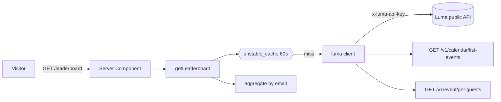

# ADR 0003: Luma API-only MVP

**Status:** Accepted  
**Date:** 2026-05-19

## Context

[ADR 0001](./0001-mvp-architecture.md) planned Supabase Postgres, magic-link auth, and admin CSV uploads. [ADR 0002](./0002-design-first-mocked-mvp.md) shipped the UI with mocked data.

We are pivoting to a simpler stack:

- **Luma public API** as the single source of truth (no database).
- **Server-side API key** in `LUMA_API_KEY` (replaces admin CSV upload and `ADMIN_EMAILS`).
- **Public leaderboard** (no auth gate in this iteration).
- **All calendar events** managed by the API key — no name or series filter.

This ADR supersedes the **database**, **auth**, **admin upload**, and **CSV ingestion** decisions in ADR 0001 and the **mock-only data** scope in ADR 0002. Brand, layout, and `LeaderboardRow` shape remain aligned with those ADRs.

## Decision

Build a **Next.js App Router** app on Vercel that aggregates check-ins from Luma at request time (with ISR caching), across every event returned by `list-events` for the calendar.

### System overview



### Data source

- **Base URL:** `https://public-api.luma.com`
- **Auth:** `x-luma-api-key: ${LUMA_API_KEY}` (server-only; never `NEXT_PUBLIC_`)
- **Endpoints:**
  - `GET /v1/calendar/list-events` — all events managed by the calendar; paginated via `pagination_cursor` / `has_more` / `next_cursor`
  - `GET /v1/event/get-guests?event_api_id=...` — paginated guest list per event

### Event scope

- Every event returned by `list-events` for the calendar tied to the API key is included.
- Events listed on the calendar but not managed by it are **not** returned by this endpoint (per Luma docs).

### Scoring

- **1 point** per `(normalized_email, event)` pair when the guest **checked in at the door** (`checked_in_at` is non-empty in Luma).
- Registrations without check-in do not count.
- **v1:** no filter on `approval_status` beyond what Luma returns in the guest list.
- **Email:** required; rows without a valid email are skipped.
- **`participant_id`:** deterministic `email:<normalized_email>` (no DB UUIDs).
- **`last_seen_at`:** ISO date `YYYY-MM-DD` from the latest `start_at` among events the person checked into.

### Caching

- `unstable_cache` wraps the full aggregation with `revalidate: 60` and tag `leaderboard`.
- Individual Luma `fetch` calls also use `next: { revalidate: 60 }`.
- At community scale this keeps Luma traffic bounded regardless of page views.

### Routes

| Route | Status |
| ----- | ------ |
| `/` | Redirect to `/leaderboard` |
| `/leaderboard` | Public; reads Luma (or mock when `MOCK_DATA=true`) |
| `/upload` | **Removed** |
| `/login` | **Removed** |

### Environment variables

| Variable | Required | Purpose |
| -------- | -------- | ------- |
| `LUMA_API_KEY` | Yes (unless `MOCK_DATA=true`) | Luma calendar API key |
| `MOCK_DATA` | No | When `true`, use `src/lib/mock/leaderboard.ts` |

### Local development

```bash
cp .env.example .env.local
# Option A — mock data, no Luma key:
MOCK_DATA=true npm run dev

# Option B — live Luma:
LUMA_API_KEY=your_key npm run dev
```

## Consequences

### Positive

- **Zero database** cost and ops.
- **No manual CSV** after events; leaderboard reflects Luma automatically (within cache window).
- **Idempotent by construction** — recompute from API, no double-count risk.
- **Full calendar coverage** — every managed event counts equally.

### Negative / trade-offs

- **Luma is the source of truth** — deletions or renames in Luma change the leaderboard immediately after cache expiry.
- **Rate limits** — many events × guest pagination can hit 200 req/min per calendar; mitigated by 60s cache but worth monitoring as the calendar grows.
- **No auth** — leaderboard is public; emails are never shown but names are.
- **No manual adjustments** — bonus points or overrides require a DB (deferred).

### Follow-ups (post-v1)

- Optional filter by event ID list or calendar when running multiple series from one key.
- Gate points on `approval_status === 'approved'` in addition to check-in.
- `revalidateTag('leaderboard')` via Luma webhook when available.
- Optional auth gate on `/leaderboard`.
- Persist snapshots if immutable history is required.

## References

- [ADR 0001](./0001-mvp-architecture.md)
- [ADR 0002](./0002-design-first-mocked-mvp.md)
- [Luma API — List Events](https://docs.lu.ma/reference/get_v1-calendar-list-events)
- [Luma API — Get Guests](https://docs.lu.ma/reference/get_v1-event-get-guests)
