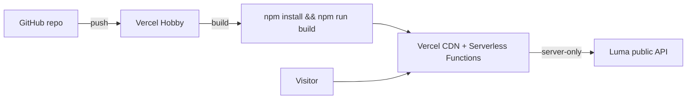

# ADR 0004: Vercel free-tier hosting

**Status:** Accepted  
**Date:** 2026-05-20

## Context

[ADR 0003](./0003-luma-api-only-mvp.md) delivers a **Next.js App Router** app with no database: the leaderboard is built server-side from the Luma public API (`LUMA_API_KEY`, 60s cache). [ADR 0001](./0001-mvp-architecture.md) originally chose **Vercel** for hosting on the free tier; this ADR records how we deploy that stack in production.

### Requirements

- **$0 hosting** for a community leaderboard at modest traffic.
- **Git-based deploys** from this repository (no custom CI required for v1).
- **Secrets only on the server** — `LUMA_API_KEY` must never be exposed to the browser.
- **Compatible with ADR 0003** — dynamic `/leaderboard`, `unstable_cache`, and outbound `fetch` to `public-api.luma.com`.

## Decision

Host the app on **Vercel Hobby** (free tier) by connecting the GitHub repository. Use Vercel’s **native Next.js** integration with default build settings. No separate backend, database, or container.

### Platform choice

| Option | Verdict |
| ------ | ------- |
| Vercel Hobby | **Chosen** — zero-config Next.js, env vars, preview URLs, fits ADR 0001 |
| Self-hosted Node | Rejected — ops overhead for no benefit at this scale |
| Supabase + Vercel | Rejected — no DB in ADR 0003 |

### Deployment model

1. **Import** the GitHub project in the [Vercel dashboard](https://vercel.com/new).
2. **Framework preset:** Next.js (auto-detected from `package.json`).
3. **Production branch:** `dev` (repository default) unless changed to `main` later.
4. **Build command:** `npm run build` (default).
5. **Output:** Next.js default (no `output: 'export'` — we need serverless for Luma calls).
6. **Environment variables** (Production and Preview):

| Variable | Required | Notes |
| -------- | -------- | ----- |
| `LUMA_API_KEY` | Yes (production) | Server-only; set in Vercel → Settings → Environment Variables |
| `MOCK_DATA` | No | Omit in production; use only for preview demos if needed |

Do **not** set `NEXT_PUBLIC_` prefixes on secrets.

### Runtime behavior on Vercel

- `/leaderboard` uses `export const dynamic = "force-dynamic"` — rendered on each request (after cache), not as static HTML at build time.
- `unstable_cache` (60s) and per-fetch `revalidate: 60` reduce Luma traffic across concurrent visitors.
- Outbound requests to `https://public-api.luma.com` require no extra Vercel configuration.
- **Build without `LUMA_API_KEY`:** succeeds because the leaderboard page is not statically generated at build time.

### Free-tier limits (relevant)

| Limit | Hobby (free) | Impact on this app |
| ----- | ------------ | ------------------ |
| Bandwidth | 100 GB / month | Fine for community traffic |
| Serverless execution | 10s per invocation (default) | **Risk** if the calendar has many events — guest fetches run sequentially per event |
| Concurrent builds | 1 | Acceptable |
| Commercial use | Hobby is for personal/non-commercial | Confirm fit for Cursor community use; upgrade to Pro if required |

If cold requests exceed 10s, mitigations (follow-ups): parallelize guest fetches, narrow event list, or upgrade plan / split aggregation into a background job with persistence.

### Domains

- **Default:** `*.vercel.app` project URL (sufficient for v1).
- **Custom domain:** optional in Vercel → Domains (still free on Hobby).

### Preview deployments

- Every PR branch gets a preview URL.
- Set `LUMA_API_KEY` for **Preview** in Vercel if previews should show live data; otherwise previews without the key will error at runtime (unless `MOCK_DATA=true` is set for Preview only).

### What we do not add (v1)

- `vercel.json` — not required; Next.js defaults are sufficient.
- Vercel KV / Postgres — no database per ADR 0003.
- Cron revalidation — 60s on-demand cache is enough for v1.
- GitHub Actions deploy workflow — Vercel Git integration replaces it.

## Consequences

### Positive

- **No hosting bill** on Hobby for expected traffic.
- **Deploy on push** to the production branch with preview URLs for PRs.
- **Same stack** as ADR 0001/0003 — no migration when moving from local dev.

### Negative / trade-offs

- **Cold starts** on serverless can add latency on first request after idle.
- **10s function limit** on Hobby may cap very large calendars until we optimize or upgrade.
- **Secrets in Vercel UI** — rotating `LUMA_API_KEY` requires a dashboard update and redeploy (or env change without rebuild for some vars).

### Follow-ups

- Parallel `listEventGuests` calls to stay under the 10s limit.
- `revalidateTag('leaderboard')` + Luma webhook for fresher data without lowering cache TTL.
- Custom domain and production branch alignment (`main` vs `dev`).
- Monitor Vercel function duration and Luma rate limits in production.

## References

- [ADR 0003 — Luma API-only MVP](./0003-luma-api-only-mvp.md)
- [Vercel Hobby plan](https://vercel.com/docs/plans/hobby)
- [Vercel environment variables](https://vercel.com/docs/projects/environment-variables)
- [Next.js on Vercel](https://vercel.com/docs/frameworks/nextjs)
